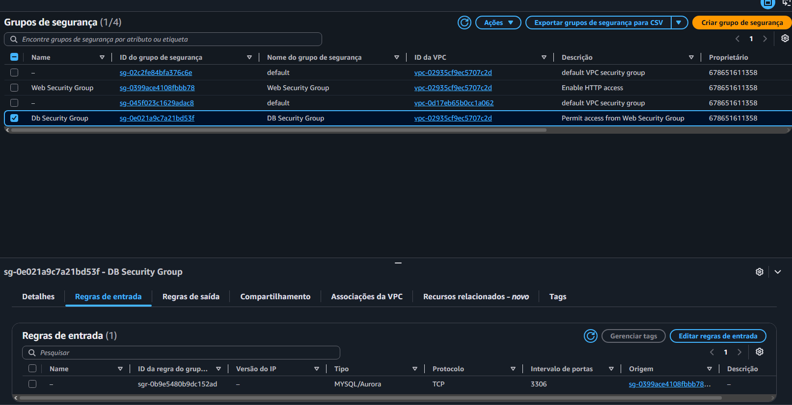
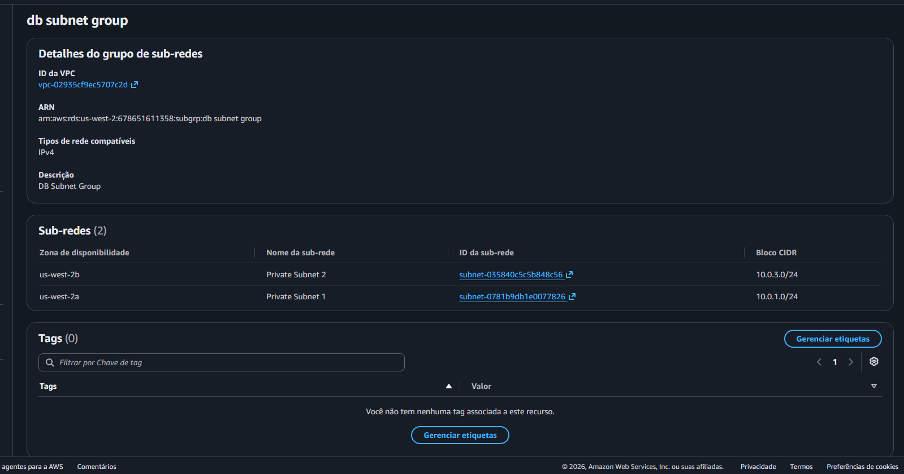
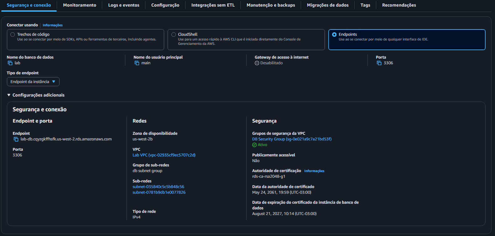
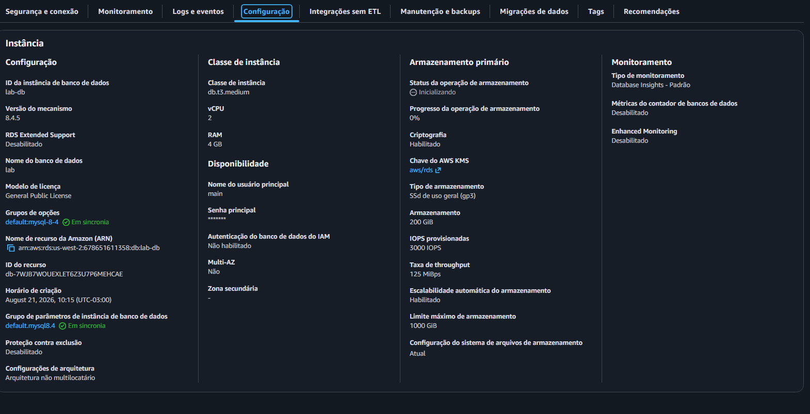
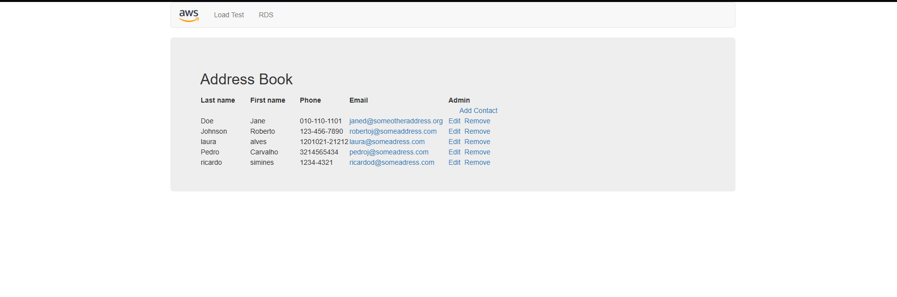

# AWS RDS Lab: Provisionamento de Banco de Dados Resiliente e Integração Web

Registro prático da construção de um ambiente de banco de dados relacional MySQL com tolerância a falhas na AWS. O projeto aborda desde o isolamento da camada de dados até a comunicação segura com uma aplicação web hospedada no Amazon EC2.

## Visão Geral da Arquitetura

* Rede VPC: Segmentação do ambiente em subredes públicas para a camada web e subredes privadas para a camada de dados distribuídas em duas Zonas de Disponibilidade.
* Servidor de Aplicação: Instância EC2 pública responsável por processar a interface e a lógica da aplicação.
* Base de Dados: Instância Amazon RDS MySQL configurada em subredes privadas.
* Controle de Acesso: Políticas de firewall Security Groups baseadas no princípio do menor privilégio, liberando a porta 3306 exclusivamente para a camada web.

## Recursos e Tecnologias

* Serviços AWS: Amazon RDS, Amazon EC2, Virtual Private Cloud VPC, DB Subnet Groups, Security Groups.
* Engine de Dados: MySQL 8
* Tecnologias Web: PHP, HTML, CSS.

## Procedimento de Execução

1. Definição de Regras de Firewall: Configuração do Security Group do banco para aceitar tráfego de entrada na porta 3306 vindo unicamente do Security Group da instância EC2.
2. Agrupamento de Subredes: Alocação de subredes privadas de diferentes zonas no DB Subnet Group para habilitar o suporte à infraestrutura de dados.
3. Provisionamento do Banco: Deploy da instância do banco de dados MySQL no Amazon RDS.
4. Validação e Conectividade: Apontamento da aplicação web para o Endpoint gerado pelo RDS e teste de persistência dos dados.

## Validação e Evidências

### 1. Configuração de Regra de Entrada no Security Group

Painel do DB Security Group exibindo a liberação da porta 3306 para conexões vindas do Web Security Group.

### 2. Associação do DB Subnet Group

Mapeamento do grupo de subredes alocando subredes privadas em zonas de disponibilidade distintas para suporte a redundância.

### 3. Endpoint de Conexão do Amazon RDS

Exibição do ponto de acesso, porta 3306 e isolamento de rede privada gerados para o banco de dados.

### 4. Configuração e Detalhes da Instância

Painel de configuração confirmando a engine MySQL 8 e a classe de instância db.t3.medium.

### 4. Persistência de Dados no App Web

Interface da aplicação web gravando e listando registros com sucesso no banco RDS.

### 5. Aplicação Web Conectada ao RDS

Interface da aplicação Address Book acessada via IP público do WebServer, confirmando a leitura e a persistência dos dados no Amazon RDS.
